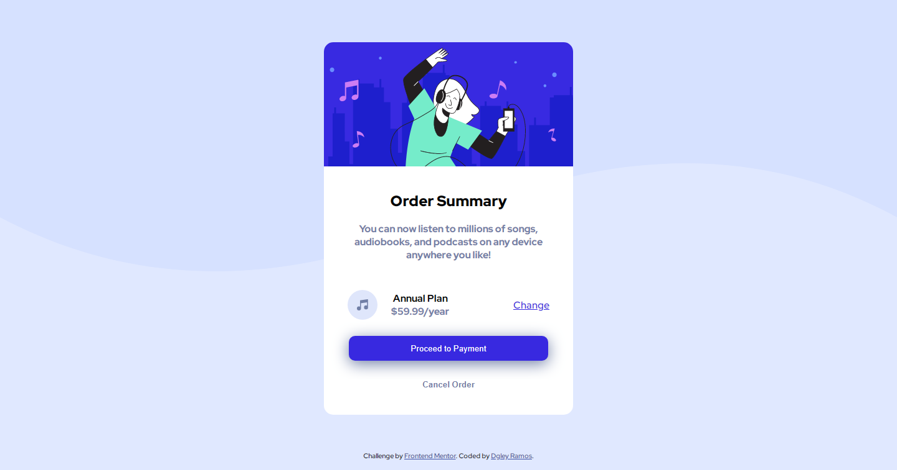

# Frontend Mentor - order summary card solution

This is a solution to the [Order Summary Card Challenge in Frontend Mentor] (https://www.front//or.io/challenges/order-summary-component-QlPmajDUj). Frontend Mentor Challenges help you improve your coding skills when building realistic projects.

## Index

- [Overview](#overview)
  - [The challenge](#o-challenge)
  - [Screenshot](#screenshot)
  - [Links](#links)
- [My process](#my-process)
  - [Created with](#integrated)
- [Author](#author)

** Note: Delete this note and update the index based on the sections you maintain. **

## Overview

### The challenge

Users must be able to:

- View focus states for interactive elements

### Print Screen

### Links

- Solution URL: [solução](https://www.frontendmentor.io/solutions/summary-order-with-flexbox-lwW-fOaXS)
- Active Site URL: [Página](https://dgleyramos1.github.io/Ordersummarycomponent/)

## My process

### Built with

- Semantic HTML5 markup
- CSS custom properties
- Flexbox

## Author

- Frontend Mentor - [@dgleyramos1](https://www.frontendmentor.io/profile/dgleyramos1)
